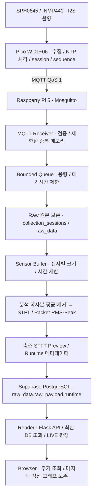
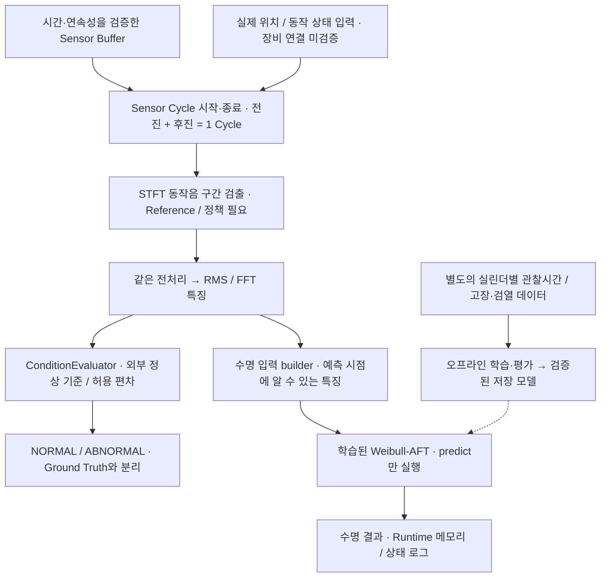

# 스마트 실린더 케이스 프로젝트

> 기존 공압 실린더에 센서를 일정하게 장착하고 음향 신호를 수집·분석하여 상태 변화를 확인하는 프로젝트다. 현재 검증한 수집·STFT·웹 모니터링과, 데이터가 더 필요한 상태 판별·수명 예측을 구분한다.

## 목차

- [01. 프로젝트 목적](#01-프로젝트-목적)
- [02. 관련연구 및 기술 선정](#02-관련연구-및-기술-선정)
- [03. 시스템 설계 및 아키텍처](#03-시스템-설계-및-아키텍처)
- [04. 데이터 수집 및 관리](#04-데이터-수집-및-관리)
- [05. 모델링 및 성능 검증](#05-모델링-및-성능-검증)
- [06. 한계 및 향후 계획](#06-한계-및-향후-계획)
- [07. 결론](#07-결론)
- [날짜별 작업 기록](#날짜별-작업-기록-리마인드)

## 01. 프로젝트 목적

### 문제 정의와 해결 방향

기존 공압 실린더의 유지보수는 작업자 점검, 별도 센서 설치 또는 센서 내장형 제품 교체에 의존할 수 있다. 외부 센서는 재설치할 때 위치·방향·압착 조건이 달라져 동일한 상태에서도 측정값이 달라질 수 있다.

본 프로젝트는 기존 실린더 외부에 케이스를 장착하여 센서 위치와 장착 조건을 일정하게 유지하고, 반복 측정한 음향 특징으로 상태 변화를 확인하는 것을 목표로 한다. 케이스 장착에도 설비 정지가 필요할 수 있으므로 ‘무정지 설치’를 성과로 주장하지 않는다. 케이스가 측정 편차를 얼마나 줄이는지는 별도 반복 장착 실험으로 검증해야 한다.

개발 대상은 SMC CD85N25-25-B 공압 실린더다. 개별 제품의 씰 재질·운전 조건은 실제 부품 사양과 실험 기록으로 확인하며, 다른 실린더 논문의 수명을 그대로 대입하지 않는다.

### 프로젝트 범위

- **현재 중심:** 원본 음향 수집, 평균 제거 전처리, STFT 주파수 변화 표시, 상태 특징 추출과 검증 기반 마련.
- **상태 판별 목표:** 검증된 정상 동작의 주파수 분포와 비교하여 NORMAL / ABNORMAL 및 이상 징후를 판단.
- **수명 분석 목표:** 별도의 실제 수명 관찰 데이터로 Weibull-AFT를 학습하여 수명 분포를 추정.
- **별도 확장 기능:** YOLO 기반 A/B 제품 검출과 주문 비교. 음향 상태 판별의 모델이 아니며, 현재 발표의 핵심 범위와 분리한다.

### 저장소 변경 및 개발 재시작 배경

기존 [ML-cylinder](https://github.com/kang0840/ML-cylinder)에서는 기능 추가와 실행 방식 변경이 반복되면서 이전 코드·새 코드·중복 구현·배포 파일의 관계가 복잡해졌다. 변경 이력과 파일 역할을 충분히 정리하지 못해 부분 수정만으로 안정성을 확보하기 어려워졌고, 개발 기준을 다시 정립하기 위해 [새 개발 저장소](https://github.com/kang0840/-re-ML--cylinder)를 만들었다.

이는 GitHub 자체의 문제가 아니며, 검증된 기능을 모두 폐기하거나 모든 코드를 새로 작성했다는 의미도 아니다. 최상위 `system/`을 공통 코드의 원본으로 관리하고, 변경·검증·배포 이력을 이 README에 기록한다. 기존 저장소와 불변 Wheel·롤백 산출물은 보존한다. 새 저장소 생성과 실제 Render 연결 전환은 별개다.

## 02. 관련연구 및 기술 선정

### 실린더 씰 상태 모니터링 연구

[Acoustic Emission-Based Condition Monitoring and Remaining Useful Life Prediction of Hydraulic Cylinder Rod Seals, Sensors, 2021](https://www.mdpi.com/1424-8220/21/18/6012)은 유압 실린더 씰의 상태 변화와 AE 신호 특징을 연구했다. 음향 특징과 열화의 관계를 검증한다는 방법론을 참고한다. 다만 해당 연구의 유압 실린더·AE 센서와 본 프로젝트의 공압 실린더·I2S 마이크는 다르므로 주파수 대역과 임계값을 그대로 적용하지 않는다.

[Analyzing Pneumatic Cylinder Service Life through Seal Material Selection, Simulation, and Experimentation, Tribology in Industry, 2025](https://www.tribology.rs/journals/2025/2025-1/15-1831.pdf)은 씰 재질, 반복 동작 및 수명시험을 다룬다. 실린더 수명에 운전 조건과 씰 재질이 영향을 준다는 실험 설계의 참고 근거다. 논문의 시험 수치는 CD85N25-25-B의 보장 수명이 아니다.

### 왜 STFT·RMS·FFT·Weibull-AFT인가?

| 기술 | 선정 이유 | 실제 역할 |
|---|---|---|
| STFT | 동작 중 주파수 분포가 시간에 따라 어떻게 변하는지 확인 | 신호처리. 자체로 정상/고장 판정하지 않음 |
| RMS·FFT | 신호 크기와 주파수 특징을 비교 | 특징 추출. RMS는 특정 주파수의 평균이 아님 |
| 정상 기준 비교 | 정상 동작 범위에서 벗어나는 특징 확인 | 통계적·규칙 기반 상태 판별. 기준은 실험으로 결정 |
| Weibull-AFT | 운전 조건·특징과 고장시간의 관계를 생존분석으로 추정 | 수명 분포 모델. 상태 라벨만으로 학습할 수 없음 |

‘장소가 바뀌어도 같은 기준’을 목표로 하지만, 상대 주파수 지표가 환경 영향을 완전히 없애는 것은 아니다. 고정 기준의 적용 범위는 실린더 종류·압력·부하·속도·센서 장착 조건을 정한 후 독립 실험으로 확인한다.

### YOLO는 왜 사용하는가?

제품 A/B를 **영상에서 구별하고 위치를 검출**하여 주문한 제품과 실제 제품이 일치하는지 확인하려는 별도 확장 기능이다. YOLO11n은 경량 객체 검출 후보이며, 음향으로 실린더 씰 고장을 판단하거나 수명을 계산하는 데 사용하지 않는다.

계획은 AI Camera / Sony IMX500에서 검출 결과를 받아 기존 주문 비교 경로에 연결하는 것이다. [Ultralytics IMX500 안내](https://docs.ultralytics.com/integrations/sony-imx500/)에 변환·배포 경로가 있지만, 이 프로젝트의 실제 변환 모델·카메라 실행·성능은 미검증이다. 현재 A/B 공정 테스트의 MANUAL 입력을 실제 YOLO 검증으로 표현하지 않는다.

## 03. 시스템 설계 및 아키텍처

### 현재 수집·모니터링 경로

다음은 현재 코드의 경로다. 실제 배포 버전과 장시간 안정성은 날짜별 검증 기록과 구분한다.



- MQTT 수신과 분석 Worker를 분리하고 Queue·Dedup·Buffer를 제한한다. 분석 오류와 overflow는 로그로 확인하며 MQTT Receiver 전체를 종료시키지 않도록 한다.
- Raw PCM을 수정하지 않는다. 분석용 새 배열에 평균 제거를 적용하며 학습과 실시간 처리의 분석 단위·전처리 계약을 맞춘다.
- 현재 웹은 **Render Backend가 DB를 조회하고 Browser가 API를 주기적으로 조회**한다. Supabase Realtime 구독이나 Render가 Pico에 직접 MQTT 연결하는 구조로 설명하지 않는다.
- Pico가 꺼지면 새 센서 데이터는 중단된다. 마지막 그래프는 보존할 수 있지만 LIVE로 간주하지 않는다. STFT 색은 해당 표시 범위의 상대 신호 크기이며, 분홍색을 곧바로 고장으로 해석하지 않는다.
- Packet RMS·Peak·Preview는 표시용이다. 검증된 한 Cycle의 특징이나 모델 예측과 구분한다.

### 상태 판별·수명 모델이 연결되는 위치



실선은 코드의 처리 책임, 점선은 학습 후 모델 공급 경로를 나타낸다. 이 도식이 실제 센서·기준·모델의 준비 완료를 뜻하지 않는다. `RuntimeAnalysisBridge`와 Pi Adapter의 `SENSOR_ANALYSIS_FACTORY`로 선택적으로 연결하며, 설정·데이터가 없으면 `CONFIG_REQUIRED`, `REFERENCE_REQUIRED`, `MODEL_REQUIRED`, `DATA_REQUIRED` 상태를 유지한다. 현재 Pi Adapter에서 실제 거리 센서 입력의 자동 공급까지 완료됐다고 확인하지 않았다.

상태 결과의 기존 저장 경로는 `processed_features` / `ml_results`다. 수명 결과는 현재 **메모리·로그까지만 연결**되어 있으며 DB·API·웹 출력은 미연결이다. 이를 연결하려고 새 API·DB 필드를 자동 생성하지 않는다.

### 독립적인 영상 AI·공정 확장

```text
현재: Render 주문 → process_orders → 기존 MQTT 공정 연결
      → MANUAL A/B 입력 → 주문값 비교 → process_judgments → Data WorX / PLC 연동

목표: AI Camera → IMX500 / 변환한 YOLO11n → A/B 검출 결과
      → 기존 주문 비교 → OK / NG / ERROR
```

YOLO는 카메라 검출 단계, Weibull-AFT는 Pi 분석 경로의 수명 추론 단계에 위치한다. PLC 실제 동작과 YOLO 실장·성능은 별도 하드웨어 검증 대상이다. 60초 미도착 ERROR는 현재 공정의 임시 설정이며 실린더 상태 판별 임계값이 아니다.

### 실행·코드·통신 계약

| 위치 | 역할 |
|---|---|
| `pico/` | MicroPython 센서 수집 / MQTT Publish |
| `system/MQTT/` | 메시지 계약·중복 판별 |
| `system/Backend/Server/sensor_runtime.py` | Queue·Buffer·분석 Runtime |
| `system/ML/Condition/` | 전처리·STFT·특징·상태 추론 연결 |
| `system/ML/WeibullAFT/pipeline.py` | 수명 데이터 검증·학습·평가·추론 |
| `system/DB/Supabase/` | 기존 DB 저장 / 모니터링 조회 |
| `ML-cylinder/deploy/pi_sensor_runtime.py` | 설치된 공통 Wheel을 사용하는 Pi 실행 Adapter |
| `ML-cylinder/public/real-monitor.js` | 웹 API 조회 / 그래프 표시 |

Pico ID `pico01..pico06`는 `cylinder_01..cylinder_06`에 일대일 대응한다. Sensor Topic은 `smart-cylinder/{cylinder_id}/sensor`, 중복 키는 **cylinder_id + session_id + sequence_id**다. client_id는 연결 식별값이지 중복 키가 아니다. 재연결만으로 session을 초기화하지 않는다.

Broker는 Pi의 Mosquitto `1883`이다. Pico는 Pi LAN 주소, Pi Subscriber는 `127.0.0.1:1883`과 `pi-subscriber` 계정을 사용한다. 장치 상태 Topic은 `cylinder/status/{cylinder_id}`이며 `ok / failed`를 사용한다. Retained 상태만으로 실제 센서 수신을 확정하지 않는다.

공개 웹은 [Render 모니터링](https://ml-cylinder.onrender.com/monitoring.html), Canonical 조회는 `/api/real-cylinder?source=canonical&serial=...` 경로다. 관리자 장치 매핑과 실제 DB 수신 시각을 함께 확인한다. `192.168.137.xxx`는 내부 주소이며 공개 웹 주소와 다르다.

## 04. 데이터 수집 및 관리

### 상태 판별 데이터와 수명 데이터는 다르다

| 구분 | 필요한 정보 | 목적 |
|---|---|---|
| 상태 판별 | 정상·손상 패킹의 독립 실험 세션, 실제 라벨, 동작 구간, 음향, 압력·부하·장착 조건 | 현재 동작의 정상 범위 / 이상 징후 판별 |
| 수명 분석 | 실린더 또는 씰 개체 ID, 예측 기준 시점, 관찰 기간, 실제 고장 또는 관찰 종료, 그 시점에 알 수 있는 특징 | 고장시간 분포·수명 추정 |
| 영상 검출 | A/B 이미지와 위치 라벨, 조명·배경·각도가 다른 독립 촬영 데이터 | YOLO 제품 검출 |

‘손상 패킹’ 라벨은 실제 조건의 설명이지 그 실린더가 몇 시간 후 고장났다는 수명 관측값이 아니다. 수집 `timestamp`가 있다는 사실만으로 누적 가동시간이나 실제 고장시간이 확보된 것도 아니다.

### 현재 확인된 Raw 품질

2026-10-08 읽기 전용 감사 기준이며, 오늘 DB를 새로 집계한 결과가 아니다.

- TRAINING 원본 **1,184패킷**: NORMAL 537, SEAL_LEAK 647. 모두 cylinder_01이며 라벨별 각 1세션이다.
- SPH0645 분석 rate 4kHz·256samples, INMP441 16kHz·1024samples로 센서당 **64ms** 길이다.
- 형식·길이 오류, 전부 0/일정값 패킷, 세션 내 중복 및 측정 시각 역행은 검사 범위에서 0건이었다.
- 비정상 세션의 sequence 누락은 17개, 정상 experiment_id는 NULL이다. 한계값·범위 초과 샘플도 있어 포화와 FIR 처리 영향을 구분해야 한다.
- 정상과 비정상의 AC RMS 분포가 겹친다. 현재 패킷 수만으로 분류 성능이나 학습 준비 완료를 확정하지 않는다.
- 패킷 sequence가 연속이어도 전체 실험 시간의 음향이 연속이라는 뜻은 아니다. 초 단위 timestamp와 짧은 패킷을 단순 연결해 Cycle 길이를 만들지 않는다.

### 저장·시간·라벨 규칙

Payload 필수값은 `cylinder_id`, `session_id`, `sequence_id`, `timestamp`, `sph0645`, `inmp441`이다. NTP 동기화 후 ISO 8601 `+09:00` 시각을 생성하며, 시간 동기화 전 정상 Sensor Payload를 Publish하지 않는다.

`collection_sessions`는 세션·모드·실험 라벨, `raw_data`는 원본 PCM과 수신 Runtime, `processed_features`는 검증된 동작 특징, `ml_results`는 Prediction을 관리한다. 기존 `process_orders` / `process_judgments`는 공정 기능의 데이터다. 정상/비정상 View는 라벨별 조회용이며 원본을 다른 DB로 옮겼다는 뜻이 아니다.

측정 시각 `timestamp / measured_at`, Pi 수신 시각 `runtime.last_received_at`, DB 생성 시각은 서로 다른 의미다. LIVE는 실제 수신 시각과 현재 시각으로 판정하며, 과거 데이터 조회 성공을 LIVE로 표시하지 않는다.

`TEST / TRAINING / OPERATION`을 구분하고 Ground Truth는 실험 조건, Prediction은 시스템 판단으로 별도 관리한다. 모든 장치를 정상·비정상 수집에 사용할 수 있으며 장치 ID만으로 고장 라벨을 만들지 않는다. 새 실험에는 experiment_id와 실험 조건을 함께 기록한다.

## 05. 모델링 및 성능 검증

### 신호 전처리와 상태 기준

원본을 보존하고 분석 복사본에 `x_centered = x - mean(x)`를 적용한다. 전처리 ID는 `mean_remove_analysis_unit_v1`이다. 이는 DC 제거이며 주파수 필터·클리핑 복구·센서 교정이 아니다. 두 센서 모두 마이크이므로 PCM 특징을 교정된 진동 속도나 누설 유량으로 표현하지 않는다.

STFT는 짧은 창마다 주파수 성분을 계산한다. 창·Hop·FFT 크기는 센서 rate와 표시 해상도에 맞춰 외부 설정으로 공급하고, 화면 표시용 설정과 실제 동작 검출 기준을 구분한다.

상태 판별의 연구 방향은 **같은 분석 시간 단위에서 주파수 대역의 상대 비중과 시간 변화를 정상 동작과 비교**하는 것이다. 후보 지표는 다음과 같다.

```text
대역 상대 에너지(t) = Σ[대역 안의 |STFT(f,t)|²] / Σ[분석 주파수 범위의 |STFT(f,t)|²]
```

같은 창·정규화·주파수 범위로 비교하며 분모가 0이면 판정하지 않는다. 이는 현재 구현 완료된 특징이 아니라 검증할 연구 방향이다. 정상 기준 생성 세션에서 대역 후보와 정상 변동 범위를 정하고, 별도 정상 검증 세션에서 오경보를 확인한 뒤 독립 손상 세션으로 평가한다. 시험용 데이터로 대역·임계값을 조정하지 않는다.

현재 `ConditionEvaluator`는 외부 정상 특징·허용 편차를 비교한다. 기준 누락 시 판정하지 않으며, 빈 기준·필수 특징 누락·NaN/Inf·잘못된 수치형은 오류로 처리해 NORMAL을 만들지 않는다. 손상 기준이 있는 경우의 Leakage Score는 상대 비교값이지 실제 누설률·고장확률·수명잔존율이 아니다.

### 상태 판별 성능 검증 계획

양성은 이상(SEAL_LEAK), 음성은 NORMAL로 정의한다.

| 실제 / 예측 | 이상 예측 | 정상 예측 |
|---|---|---|
| 실제 이상 | TP: 이상 검출 | FN: 이상 놓침 |
| 실제 정상 | FP: 오경보 | TN: 정상 확인 |

평가 시 Accuracy=(TP+TN)/전체, Precision=TP/(TP+FP), Recall=TP/(TP+FN), F1=2PR/(P+R), 오경보율=FP/(FP+TN)을 함께 보고한다. 분모가 0인 지표는 산출 불가로 표시한다. 이상 Recall과 오경보율을 우선 검토하고 단일 정확도만으로 성능을 주장하지 않는다. 지표 정의는 [scikit-learn 평가 문서](https://scikit-learn.org/stable/modules/model_evaluation.html#confusion-matrix)를 따른다.

**같은 세션의 인접 패킷을 학습·시험 양쪽으로 무작위 분할하지 않는다.** 실험 세션과 가능하면 실린더 개체를 분리한다. 여러 장소·압력·부하 조건의 시험을 따로 보고하고, 기준 확정 이후 시험 데이터를 변경하지 않는다. 판정 보류·불완전 Cycle·누락 구간은 개수와 비율을 공개해, 쉬운 구간만 평가하는 문제를 방지한다. 현재 성능 검증을 마친 분류 모델·혼동행렬 수치는 없다.

피드백에서 전달된 혼동행렬 설명 링크는 접속 오류로 본문을 확인하지 못했으므로, 검증 계획은 위 공식 문서로 확인했다. 혼동행렬은 AI 모델이 아니라 **평가 도구**다.

### Weibull-AFT 수명 모델

Weibull-AFT는 센서·운전 특징에 따라 수명 분포의 척도를 추정한다.

```text
λ(x) = exp(β0 + β1x1 + ... + βpxp)
S(t | x) = exp[-(t / λ(x))^ρ]
평균 수명 E[T | x] = λ(x) × Γ(1 + 1/ρ)
중앙값 수명 = λ(x) × (ln 2)^(1/ρ)
```

시간의 기준점과 단위는 학습·추론에서 같아야 한다. 현재 `WeibullPipeline.predict()`는 `predict_median`을 사용해 `median_duration_from_prediction_origin`을 반환한다. **평균 수명이나 이미 사용한 실린더의 조건부 잔여수명과 같지 않다.** 평균/중앙값 함수의 구분은 [lifelines 공식 문서](https://lifelines.readthedocs.io/en/latest/fitters/regression/WeibullAFTFitter.html)를 따른다.

고장 시점은 학습의 목표값이고, 아직 관찰하지 않은 미래 고장 여부·시간을 현재 추론 입력에 넣지 않는다. 동일 개체를 학습·시험에 중복 배치하지 않는다. 코드의 수명 평가는 C-index와 실제 고장이 관찰된 시험 표본의 MAE를 구분한다. C-index는 순서 성능이며 시간 오차 자체가 아니다. 관찰 고장만의 MAE는 선택 편향 가능성이 있으므로 전체 수명 정확도로 표현하지 않는다. 향후 데이터가 충분하면 검열을 고려한 calibration·Brier 평가와 불확실성 검증을 추가한다. 현재 실제 수명 모델 성능은 DATA REQUIRED다.

### YOLO와 시스템 전체 검증 계획

YOLO는 독립 촬영 시험 데이터에서 클래스별 Precision·Recall, mAP@0.5와 mAP@0.5:0.95, 오분류·미검출 및 실제 장비 지연을 평가한다. 같은 영상의 연속 프레임을 학습·시험에 나눠 성능을 부풀리지 않는다. ‘정확도 90%’는 기존 목표이지 측정된 결과가 아니다. 지표는 [Ultralytics 평가 문서](https://docs.ultralytics.com/guides/yolo-performance-metrics/)를 참고한다.

케이스 재장착 전후 특징의 변동, 패킷 누락·중복·오류 격리, STFT 주파수 재현성, DB 저장 성공과 수신→웹 표시 지연도 각각 측정한다. 단위 테스트 통과와 합성 신호 결과를 실제 실린더 모델 성능으로 바꾸어 표현하지 않는다.

## 06. 한계 및 향후 계획

### Run-to-Failure 부족에 대한 단계별 대안

| 단계 | 실행 방안 | 성과로 보고할 수 있는 것 |
|---|---|---|
| 단기 | 같은 장치·장착 조건에서 정상/손상 상태를 여러 독립 세션으로 교차 수집 | 상태 특징의 구별 가능성과 오경보. 실제 수명 숫자는 제외 |
| 중기 | 개체별 사용 이력·압력·부하·정비·관찰 종료를 추적 | 고장하지 않은 개체도 오른쪽 검열 관측으로 보존 |
| 장기 | 실제 고장 관측이 축적되면 Weibull-AFT 학습·개체 독립 평가 | 검증된 적용 조건 안의 수명 분포와 불확실성 |
| 교육용 대체 | 공개 수명 데이터 또는 명확히 합성이라고 표시한 테스트 데이터로 코드 경로 점검 | 방법·프로그램 동작만 확인. 대상 실린더 수명으로 주장하지 않음 |

검열 관측은 ‘고장하지 않아서 버리는 데이터’가 아니지만 **고장 사건이 전혀 없는 자료만으로 신뢰할 수 있는 수명을 확보할 수 있다는 뜻은 아니다.** 손상된 씰을 교체하여 얻은 정상/비정상 비교는 자연 열화에 따른 고장시간 시험을 대체하지 않는다. 장기 시험이 어려우면 이번 성과를 상태 모니터링으로 한정하고 수명 모듈은 확장 준비로 보고한다.

### 남은 검증과 범위 제한

- 동작 시간·연속성 확인, 실제 위치 센서 입력, Reference·대역·임계값 확정.
- 포화·FIR 영향과 주변 소음·압력·부하·센서 장착 편차 검증.
- 독립 세션 및 실린더 확보 후 상태 성능 평가. 여러 장소에서도 기준을 고정해 사용할 수 있는지는 별도 시험.
- 실수명 데이터와 평균/조건부 잔여수명 출력 계약 검증. 수명 DB·API·웹 연결은 별도 승인.
- YOLO 실장 및 Data WorX·PLC 실제 공정 검증은 현재 핵심 발표와 분리.
- 첨부 문서의 34번 **MQTTS/TLS는 현재 구현 범위에서 제외**한다. Pi 내부망 MQTT 인증·ACL을 유지하되 암호화 통신 완료로 주장하지 않는다. 추후 인증서·호환성·운영 필요성을 확인한 승인 범위에서 진행한다.
- MQTT·Wi-Fi 비밀번호와 DB Secret은 외부 주입하고 Git·문서·로그·웹 클라이언트에 기록하지 않는다. Broker를 인터넷에 직접 공개하지 않는다.
- DB Schema·RLS·Topic·Payload·PLC와 실제 데이터는 이번 문서 정리 및 판별기 검증 수정에서 변경하지 않는다.

최신 공통 배포 산출물은 **0.1.10**이며 2026-10-08 새 GitHub 저장소에 반영했다. 실제 Pi·Render의 0.1.10 설치는 확인하지 않았다. 2026-10-09 입력 검증 수정은 로컬 소스에만 있으며 기존 0.1.10 Wheel에 포함되지 않는다. 동일 버전 Wheel을 덮어쓰지 않고 신규 버전 생성·배포는 별도 승인으로 진행한다.

## 07. 결론

기존 외부 센서의 재장착 조건 차이와 수집·분석·표시의 단절 문제를 줄이기 위해, 케이스 기반 장착 개념과 **Pico → MQTT → Pi 분석 → DB → Render 웹** 처리 구조를 구성했다. 현재 성과는 원본 보존, 실시간 STFT 표시 경로와 데이터 품질·오류 검증 기반이며, 케이스의 편차 감소 효과나 상태 판별 정확도·실제 수명 성능을 검증했다는 의미는 아니다.

수치로 확인된 결과는 2026-10-08 기준 Raw **1,184패킷(정상 537 / SEAL_LEAK 647)**의 품질 감사와, 모니터링 기록 조회의 Runtime JSON 내용량 **329,222 → 43,621바이트(약 87% 감소)**다. 후자는 조회 필드 축소의 내용량 비교이며 응답시간이 87% 줄었다는 뜻이 아니다. 사용자 확인으로 여러 휴대폰·패드의 그래프 표시를 확인했지만 장시간 장비 안정성 검증과 구분한다.

이번 프로젝트의 다음 성과 판단은 **독립 실험에서 이상 Recall·오경보율, 반복 장착 편차 및 웹 지연을 실제로 측정하는 것**이다. 장기 수명 관측이 부족한 동안에는 수명 숫자를 만들지 않는다. 최종적으로 “상태 변화를 관찰하고 검증하는 기반을 확보했으며, 검증된 상태 기준과 실제 수명 데이터가 준비되면 각 모델을 연결하는 구조”로 정리한다.

---

## 날짜별 작업 기록 (리마인드)

사용자가 지칭하는 리마인드 MD는 이 최상위 `README.md`다. 앞으로 작업 완료 시 날짜와 수정 내용, 검증 결과, 배포 여부 및 남은 작업을 이 절에 추가한다. 날짜는 한국 시간 기준이며, 미검증 또는 미배포 작업을 완료로 기록하지 않는다. 아래는 대화·실행 결과로 날짜를 확인할 수 있는 최근 작업부터 기록했다.

### 2026-10-07

- **0.1.8 저장·모니터링 개선:** 확인된 세션 재등록·재조회와 방금 저장한 Raw 재조회를 줄였다. 일반 패킷의 DB 요청 경로를 5회에서 2회로 줄이고, 최신 Raw가 처리 중이면 같은 세션의 마지막 Runtime 저장 결과를 조회하도록 수정했다.
- **상태 표시 수정:** Runtime 누락은 `WAITING_FOR_DATA`로 표시한다. 기존 수신 시각과 10초 STALE 계약을 유지하며 오래된 데이터를 LIVE로 만들지 않는다.
- **패키지 검증:** 0.1.8 Wheel 생성, Canonical Source/내용/SHA 검증 완료. 관련 테스트 177개 통과, 8개 건너뜀. 기존 0.1.7 Wheel은 변경하지 않았다.
- **Git 반영:** `kang0840/ML-cylinder`의 `main`에 Commit `283a962`를 Push했다. 이 기록만으로 Render의 새 버전 배포 완료를 확정하지 않는다.
- **Pi 및 웹 관찰:** 사용자 실행 로그에서 Raw·STFT·Preview·Runtime 저장 성공을 확인했다. 공개 웹 API의 관찰 시점에는 수신 지연이 약 2~3초였고 이전 약 52초 지연보다 줄었다. 다만 조회 중 도착한 최신 행이 NO_DATA로 표시되는 LIVE 판정 시각 오류를 추가 발견했다. 지속 성능 보장은 아니다.

### 2026-10-08

- **학습 Raw 품질 재확인(노트북·읽기 전용):** Supabase TRAINING 원본 1,184패킷(정상 537, SEAL_LEAK 647)을 조회해 노트북 메모리에서 전체 s32le PCM을 검사했다. 두 센서 형식·길이 오류, 전부 0/일정값 패킷, 세션 내 중복, 식별값 불일치와 측정 시각 역행은 각각 0건이다. 정상 sequence는 연속이며 비정상은 17개 누락이다. 정상 SPH0645는 24bit 정확한 한계값 213샘플(2패킷)·범위 초과 39샘플(3패킷), INMP441은 정상/비정상 각각 한계값 41샘플(10/12패킷)이 있어 포화 또는 처리 영향 확인이 필요하다. SPH0645 FIR 출력 범위 초과만으로 센서 고장을 확정하지 않는다. 평균 제거 AC RMS 중앙값은 정상/비정상 SPH0645 19,245.06/17,621.48, INMP441 11,802.28/12,017.94로 분포가 겹친다. INMP441 DC 평균은 -457,736.36/-463,248.63으로 기존 평균 제거 전처리가 필요하다. 라벨별 각 1세션·동일 cylinder_01이며 정상 experiment_id는 NULL, Cycle 연결과 학습용 processed_features는 0건이다. 탐색적 STFT 비교는 가능하나 최종 학습 준비 완료는 아니다. DB 서버 전체 신호 집계는 임시 공간 오류와 응답 시간 초과가 발생해 더 실행하지 않고 패킷 100개씩 읽어 메모리 분석으로 전환했다. DB·원본·라벨·코드·모델·Wheel은 변경하지 않았고 결과만 이 README에 기록했다. GitHub Push와 배포는 하지 않았다.

- **0.1.10 GitHub 반영 완료:** 새 개발 저장소 `kang0840/-re-ML--cylinder`의 `main`에 상태 판별·Weibull-AFT 연결 코드, 신규 Wheel과 관련 검증·문서 14개 파일을 Commit `ba33903`으로 Push했다. 원격 main 해시 일치를 확인했다. 실제 Pi·Render 배포는 하지 않았으며 기존 Render 연결 저장소 `kang0840/ML-cylinder`는 변경하지 않았다. 관련 없는 로컬 변경과 과거 Wheel은 보존했다.

- **0.1.10 GitHub 배포 산출물 준비:** 상태 판별·Weibull-AFT 선택적 연결을 포함해 공통 패키지를 0.1.10으로 생성했다. 버전·requirements·Pi 실행기 검사·패키지 테스트를 갱신했으며 Canonical 22개 모듈과 내장 Source Manifest 일치, 분리 환경 설치 및 pip check, 통합·패키지·A/B 회귀 테스트 228개 통과/8개 건너뜀을 확인했다. Wheel SHA-256은 `3401c1ba2aa96e12b4e9d662c315e2d4424ffa9a3758a39eb6758017a3c7b9f5`다. 0.1.9 및 이전 Wheel은 보존했다. 사용자의 후속 지시로 배포 대상은 새 GitHub 저장소 `kang0840/-re-ML--cylinder`로 한정하며 Pi·Render 설치, DB/API/Web 출력 변경과 자동 학습은 하지 않는다. 실제 판별 정책·학습 모델·수명 데이터 주입과 장비 검증은 남아 있다.

- **상태 판별·수명 모델 연결 준비:** Canonical `realtime_inference.py`에 `RuntimeAnalysisBridge`를 추가하고 Pi Adapter의 Condition 호출부에 연결했다. 외부 `SENSOR_ANALYSIS_FACTORY=설치된모듈:함수`가 검증된 판별 기준, Cycle/STFT 검출기, 학습된 WeibullPipeline과 수명 입력 builder를 제공한다. 완료 동작 구간의 특징에서 상태 판별 후 수명 모델의 predict만 호출하며 자동 학습·가짜 기준값·수명 출력은 만들지 않는다. 모델/데이터 누락은 DATA_REQUIRED/TRAINING_NOT_AVAILABLE로 유지하고 수명 오류는 상태 판별을 중단하지 않는다. 수명 결과는 Runtime 메모리와 상태 로그에만 남기며 평균 수명이 아닌 기존 중앙값 수명 계약을 유지한다. 관련 통합 테스트 148개 통과, 실제 장비/데이터 필요 8개 건너뜀. DB/API/Web 변경, Wheel 재생성, Git Push와 Pi/Render 배포는 하지 않았다. 실제 동작 구간·정상 기준·모델·수명 데이터의 준비 및 주입은 남아 있다.

- **음향 시간 범위와 연속성 주의:** 센서당 패킷 음향 길이는 64ms다. 정상 세션 측정 시각 범위 274초에 저장 샘플 환산 합계 34.368초, 비정상 337초에 41.408초이며 중복 없는 음향 샘플이라는 전제의 단순 합계다. 패킷 sequence 연속은 전체 실험 시간의 연속 음향 수집을 보장하지 않는다. 비정상 sequence 누락 경계는 17곳(각 1개), 측정 시각 역행은 두 세션 모두 0건이다. 현재 초 단위 timestamp만으로 패킷 간 음향 연속성을 확정할 수 없으므로 패킷을 이어 붙인 시간축으로 동작 길이·Cycle을 판단하지 않는다.

- **Raw 신호 상세 품질 분석(읽기 전용):** Supabase 원본 정상 537패킷·SEAL_LEAK 647패킷의 두 센서를 s32le로 해석해 전체 패킷 AC RMS·DC·최솟값/최댓값·일정값·24bit 한계값을 확인했다. 일정값 chunk는 모두 0건. AC RMS 중앙값은 정상 SPH0645 19,245.06/INMP441 11,802.28, 비정상 SPH0645 17,621.48/INMP441 12,017.94로 분포가 겹친다. INMP441 평균 DC는 정상 -457,736.36/비정상 -463,248.63이며 기존 평균 제거 전처리 필요성을 확인했다. 정확한 24bit 한계값 샘플은 정상 INMP441 41개·SPH0645 213개, 비정상 INMP441 41개·SPH0645 0개이며 정상 SPH0645에는 범위 초과 39개가 있다. 이는 포화/처리 영향 점검 대상이지 센서 고장 확정이 아니다. SPH0645 FIR 출력은 s32le이며 필터 오버슈트 가능성도 구분해야 한다. Canonical Parser·Extractor로 라벨별 sequence 100/300의 4패킷을 진단용 FFT 비교한 결과 우세 주파수가 15.625~1,218.75Hz로 달랐으나 전체 특징·누설 주파수·동작 검출 기준으로 확정하지 않았다. RMS·FFT 값은 상대 PCM 단위이고 Cycle 특징이나 모델 평가 결과가 아니다. 원본·라벨·코드·모델·DB 구조는 변경하지 않았다. 동작 구간, 연속성, 포화 원인과 독립 세션 수집을 검증하기 전 학습 준비 완료로 보고하지 않는다.

- **새 개발 저장소 최신화 검증:** 0.1.9 버전 정보·requirements·Pi Adapter·웹 조회 수정·관련 테스트·AGENTS와 신규 Wheel을 새 저장소 작업 사본에 동기화했다. 기존 Canonical DB 조회·LIVE 수정 소스는 Hash 비교로 이미 일치함을 확인했으며 기존 Wheel은 보존했다. 동기화 사본의 Wheel/Canonical 22개 모듈·Manifest·SHA 검증 및 관련 회귀 테스트 221개 통과/8개 건너뜀을 확인했다. 새 저장소에 관련 11개 파일만 반영하며 Render 연결 전환·Pi 배포·DB 데이터 수정은 수행하지 않는다.

- **학습용 Raw 초기 품질 감사(읽기 전용):** 정상 537건·SEAL_LEAK 647건은 모두 cylinder_01의 서로 다른 TRAINING 세션이며 각 세션 내 sequence 중복은 0건이다. 정상은 1~537 연속, 비정상은 1~664 중 17개 sequence가 저장되지 않았다. 두 센서 모두 base64/s32le PCM이 있으며 SPH0645는 4kHz·256samples/1024bytes, INMP441은 16kHz·1024samples/4096bytes로 일치하고 전체 바이트가 0인 chunk는 0건이다. 정상 세션 experiment_id는 NULL이라 실험 조건 추적에 제한이 있고 라벨별 각 1세션이므로 세션 독립 학습·평가에는 추가 실험이 필요하다. 일정값·clipping·실제 동작 구간·수집 조건·실제 라벨 정확성은 미검증이다. DB와 라벨은 변경하지 않았다.

- **추가 휴대폰 검증:** 사용자가 패드에 이어 다른 휴대폰들에서도 웹 그래프 표시를 확인했다. 다중 기기 웹 표시 문제는 사용자 검증 기준 해결로 정리하며 새 센서 LIVE·Pi 업데이트·Cycle/ML 성능까지 검증된 것으로 확대하지 않는다.

- **오늘 최종 확인·남은 작업:** 사용자가 패드에서 공개 모니터링 그래프가 표시되는 것을 확인했다. 오늘은 0.1.9 Wheel 생성·검증(220 통과/8 건너뜀), 웹 중복 요청·시간 초과·429 대기·마지막 그래프 보존 수정(142 통과/8 건너뜀), 기존 Render 연결 저장소의 `065b436` 웹 배포와 `3a5653a` 0.1.9 배포를 진행했다. 사용자가 Render 배포 완료를 확인했으며 이후 공개 API 3회 모두 HTTP 200과 STFT Preview를 확인했다. 과거 데이터(STALE)의 다른 기기 표시 문제는 패드에서 해소 확인됐지만 친구 PC 재확인·새 센서 입력 LIVE·장시간 안정성·서버 내부 병목 및 Pi 0.1.9 설치는 남아 있다. 아래 미배포·미확인 문구는 각 작업 당시의 중간 기록이며 이 최종 확인과 구분한다. DB Schema·RLS·MQTT 규격·원본 데이터·학습 기준은 변경하지 않았다. 이 README만 새 개발 저장소 `kang0840/-re-ML--cylinder`에 반영하며 해당 저장소의 코드 동기화나 Render 연결 전환을 의미하지 않는다.

- **0.1.9 Render 배포 후 확인:** 사용자가 배포 완료를 확인했다. 공개 Canonical API(limit=100)를 순차 3회 조회하여 모두 HTTP 200, 응답 3.12초·3.55초·2.91초, STFT Preview 존재 및 STALE 상태를 확인했다. 평균 약 3.19초이며 측정 환경이 다르므로 지속 성능 향상 보장은 아니다. 실제 다중 기기 그래프 표시·새 센서 입력 LIVE와 Pi 0.1.9 설치는 미검증이다.

- **Render용 0.1.9 Git 반영:** 사용자 승인으로 기존 Render 연결 저장소 `kang0840/ML-cylinder`의 `main`에 0.1.9 Wheel과 requirements 경로·SHA 변경 두 파일만 Commit `3a5653a`으로 Push했다. Wheel의 22개 Canonical 모듈·Source Manifest·최종 SHA 일치를 재확인했다. 기존 Wheel과 다른 로컬 변경은 보존했다. Render 실제 설치 버전·Live 커밋 확인 및 배포 후 응답시간 비교는 별도 검증 대상이며 Pi 설치는 수행하지 않았다.

- **웹 조회 누적 방지 Git 반영:** 기존 Render 연결 저장소 `kang0840/ML-cylinder`의 `main`에 `public/real-monitor.js`만 Commit `065b436`으로 Push했다. 다른 로컬 변경, 0.1.9 Wheel 및 저장소 연결 전환은 포함하지 않았다. Push 직후 공개 JavaScript는 HTTP 200이지만 새 단일 요청·시간 제한 코드가 없어 아직 구버전임을 확인했다. Render 배포 완료와 실제 그래프 복구는 미확인이다.

- **웹 조회 누적 방지:** `real-monitor.js`의 2초 고정 중첩 요청을 완료 후 재예약 방식으로 변경했다. 단일 요청 잠금, 15초 AbortController 제한, 실패 시 최대 30초 backoff와 HTTP 429 시 60초 대기를 추가했다. 조회 오류는 마지막 정상 그래프를 지우지 않고 LIVE 아님을 표시한다. 관련 통합 테스트 142개 통과, 실제 장비/데이터 필요 8개 건너뜀 및 JavaScript 문법 검사를 통과했다. Git Push·Render 배포는 수행하지 않았고 서버 지연·429 발생 계층 확인과 실제 다중 기기 검증은 남아 있다. Frontend 자산 수정이며 기존 0.1.9 Wheel은 변경하지 않았다.

- **DB 조회 최적화:** Monitoring 과거 기록 조회는 Runtime 전체 대신 수신 시각·상태·Packet 지표만 JSON 경로로 조회한다. 큰 STFT 행렬은 최신 Preview 조회에만 포함한다. 이미 가져온 같은 세션의 처리 완료 행은 재사용하여 추가 조회를 생략한다.
- **Preview 정리 최적화:** 조회 범위가 마지막 행까지 도달한 경우 중복 확인 SELECT를 생략한다. 범위가 가득 찬 경우에는 기존 backlog 확인을 유지한다. Raw를 삭제하지 않는다.
- **LIVE 판정 수정:** 실제 현재 시각을 DB 조회 완료 후 계산한다. 테스트의 명시적 시각 주입과 미래 시각·누락·STALE 판정은 유지한다.
- **검증:** 관련 통합 테스트 141개 통과, 8개 건너뜀. 실제 DB 최근 OPERATION 100건을 읽기 전용으로 비교한 Runtime JSON 크기는 329,222바이트에서 필요한 필드 43,621바이트로 약 87% 감소했다. 이 수치는 JSON 내용량 비교이며 실제 네트워크 지연 또는 응답시간 측정값은 아니다.
- **변경하지 않은 영역:** DB Schema, RLS, MQTT 규격, 원본 Raw, Pico 코드 및 ML 판정 기준.
- **배포 상태:** 이번 최적화는 로컬 소스에만 적용했다. 0.1.9 Wheel 생성 및 Pi/Render 배포는 아직 진행하지 않았다. 기존 0.1.8 Wheel은 보존했다. 배포 후 실제 응답시간·LIVE 안정성 확인이 남아 있다.
- **기록 규칙 확정:** 별도 리마인드 파일을 만들지 않고 최상위 README의 이 절을 날짜별 작업 기록으로 사용한다.
- **새 공개 저장소 업로드 준비:** 사용자 지정 `kang0840/-re-ML--cylinder`에 최상위 구조를 유지한 현재 파일 스냅샷을 올린다. README·AGENTS·Canonical system·Pico·ML-cylinder·Wheel·롤백 폴더를 포함하고 기존 Git 이력, Secret/.env, 캐시, 운영 로그, DB 백업, 학습 엑셀 및 이전 배포 ZIP은 공개 대상에서 제외한다. 로컬 원본을 삭제하거나 기존 `ML-cylinder` 원격 및 Render 연결을 변경하지 않는다. 이 항목은 업로드 준비 기록이며 Push 완료 여부는 후속 기록으로 구분한다.
- **새 공개 저장소 업로드 완료:** 271개 파일의 현재 스냅샷을 `https://github.com/kang0840/-re-ML--cylinder`의 `main`에 최초 Commit `8267529`로 Push했다. 확인한 Secret 서명 검사에서 일치 항목은 없었으며 기존 Git 이력은 포함하지 않았다. 기존 저장소/Render 연결 변경 및 새 서비스 배포는 수행하지 않았다. 최신 Canonical 소스에는 2026-10-08 조회 최적화가 있지만 설치용 Wheel은 아직 0.1.8이므로 코드와 배포 산출물의 차이는 0.1.9 생성 시 해소해야 한다.
- **저장소 변경 배경 문서화:** 코드와 파일의 관계가 복잡하게 얽히고 정리가 누적되지 않아 기존 상태에서 부분 수정으로 안정성을 확보하기 어려웠던 점, 새 저장소에서 개발 기준을 재정립하며 개발을 다시 시작한 이유를 README 앞부분에 추가했다. 기존 기능의 전면 폐기나 기존 저장소/Render 연결 전환 완료로 표현하지 않는다.
- **README 목차 반영:** 사용자가 추가한 1~18번 목차를 확인하고 내용을 보존했다. Markdown 표시를 위한 빈 줄만 보완하여 새 저장소에 반영한다.
- **목차 숫자 표시 수정:** GitHub에서 목차 번호가 중첩 번호 목록으로 해석되어 로마 숫자로 보이는 현상을 방지하기 위해 마침표를 Markdown 이스케이프했다. 목차 번호는 `01`~`18` 그대로 표시되도록 하고 항목 제목과 본문은 유지했다.
- **0.1.9 Wheel 생성·검증 완료:** 앞서 로컬에 적용한 DB 조회 투영, 같은 세션의 결과 재사용, Preview 정리 조회 축소와 DB 조회 완료 후 LIVE 시각 판정을 포함하여 공통 패키지를 0.1.9로 생성했다. pyproject·패키지 버전, requirements Wheel/SHA 참조, Pi Adapter 버전 검사와 패키지 테스트 기준을 갱신했다. 22개 Canonical Python 모듈 및 내장 Source Manifest 일치 검증과 로컬 설치 후 관련 통합·패키지·A/B 회귀 테스트 220개 통과, 8개 건너뜀을 확인했다. 최종 Wheel SHA-256은 `497fc5542799e4bd33d0501fe32e8d91b61edd6a4acbf5267ec7baca78af8b0b`다. 기존 0.1.8 및 이전 Wheel은 보존했다. Pi·Render 배포, Git Push와 실제 장비 LIVE 안정성 검증은 이번 작업에서 수행하지 않았다. DB Schema·RLS·MQTT 규격·Raw 원본·분석 기준 변경은 없다.

### 2026-10-09

- **웹 평가 항목 배포 완료:** 정확도·이상 검출률·오경보율을 모두 ‘평가 데이터 부족’으로 표시하는 UI만 추가했다. 연산 미구현 상태와 독립 평가 데이터 필요를 명시했다. 기존 요약 5개 및 RMS/STFT 그래프 유지·항목 ID 중복 없음 검사를 통과했고 기존 통합·A/B 테스트는 227개 통과/8개 건너뜀이다. 새 개발 GitHub main에 `1fa5425`, 기존 Render 연결 GitHub main에 HTML 한 파일만 `9b3e911`로 반영했다. Render 공개 페이지의 실제 응답 HTML에서 3개 항목과 NOT_IMPLEMENTED 표시를 확인했다. 초기 조회는 시간 초과됐으나 재조회는 성공했다. DB/API·Wheel·Pi·계산식·학습 기준은 변경하지 않았다. 실제 모델 성능 계산과 새 장비 실시간 확인은 수행하지 않았으며 독립 정상·비정상 평가 데이터 확보 후 별도 승인 대상이다.
- **웹 평가 항목 표시 준비:** 사용자 지시에 따라 monitoring.html에 정확도·이상 검출률·오경보율의 별도 준비 영역만 추가했다. 값은 모두 ‘평가 데이터 부족’, 연산은 ‘미구현’으로 명시한다. 독립 평가 데이터가 없는 상태에서 숫자·0%·신뢰도를 성능으로 출력하지 않는다. 기존 요약 5개·STFT/RMS 그래프·JS 조회·API·DB·Wheel은 변경하지 않았다. GitHub 및 Render 반영 완료는 후속 검증 기록으로 구분한다.
- **GitHub 업로드 완료:** README 재구성·판별기 입력 검증·관련 테스트 3개 파일을 새 개발 저장소 `kang0840/-re-ML--cylinder`의 main에 Commit `b275921`로 Push했고 원격 main 해시 일치를 확인했다. 업로드용 사본에서도 통합·A/B 공정 테스트 227개 통과/8개 건너뜀을 재확인했다. 기존 Wheel·롤백 및 관련 없는 변경은 제외했고 Pi/Render 배포는 수행하지 않았다. 이 완료 기록도 같은 저장소의 후속 문서 커밋으로 반영한다.
- **GitHub 업로드 준비:** 사용자 승인으로 새 개발 저장소 `kang0840/-re-ML--cylinder`의 main에 이번 README 재구성·판별기 입력 검증·관련 테스트 3개 파일만 반영한다. 관련 없는 로컬 변경과 기존 Wheel은 포함하지 않는다. 원격 반영 완료는 후속 확인 기록으로 구분하며 Pi/Render 배포는 하지 않는다.
- **판별기 입력 검증 수정:** 빈 기준·필수 특징 누락·잘못된 수치형·NaN/Inf와 계산 overflow가 NORMAL로 처리되지 않도록 ConditionEvaluator의 특징·허용 편차·손상 기준 검증을 보강했다. 기준 미공급은 기존 판정 보류 계약을 유지한다. 실제 기준값·Threshold는 만들지 않았다.
- **피드백 반영 문서 정리:** 첨부 프로젝트 정리와 기존 README 기록을 대조해 목적→관련연구→아키텍처→데이터→모델링·검증→한계·계획→결론의 7장으로 재구성했다. 기존 날짜별 기록은 보존했다. 현재 DB 조회 기반 웹 경로와 선택적인 Cycle/Condition/Weibull 연결, 독립 YOLO 확장을 구분하고 AI 위치를 표시했다. MQTTS/TLS는 미구현 확장으로 분리했다.
- **평가·수명 설명 보완:** 상태 판별의 혼동행렬·Recall·오경보율·세션 독립 평가, YOLO 검출 지표, Weibull 개체 독립 평가와 검열·중앙값/평균 차이를 설명했다. 장기 고장 데이터 부족 시 단기 상태 검증→개체별 관찰→실수명 학습의 대안을 제시했다. 미측정 성능과 논문 수명을 실제 성과로 기록하지 않았다.
- **검증:** 합성 입력·기존 Runtime 관련 통합 테스트 185개 통과/8개 건너뜀을 먼저 확인했다. 추가 Bridge 회귀 및 최종 검증 결과는 아래 후속 기록에 명시한다. 기존 기록 보존과 현재 경로·함수 대조를 수행하며 실제 장비·현재 DB 재집계·모델 성능은 검증하지 않는다.
- **최종 검증:** 잘못된 판별 입력의 보류·오류 처리, 수명 모델 호출 차단 및 오류 이후 다음 Cycle 처리 회귀를 포함해 통합·A/B 공정 테스트 227개 통과/8개 건너뜀을 확인했다. Python Black 서식 검사도 통과했다. 이 결과는 합성 입력·Mock 검증이며 실제 상태 판별 정확도나 수명 성능이 아니다. 기존 2026-10-07/08 기록은 내용 변경 없이 보존했다.
- **배포 및 변경 범위:** 로컬 판별기·관련 테스트·README만 수정했다. Git Push, 새 Wheel 생성, Pi/Render 배포, DB Schema/RLS·MQTT 규격·Pico·PLC 변경은 수행하지 않았다. 기존 0.1.10 Wheel과 롤백 산출물은 불변으로 보존하며 이번 소스 수정은 해당 Wheel에 포함되지 않는다.

### 2026-10-10

- **STFT 웹 GitHub·Render 배포 완료:** 사용자 배포 승인으로 기존 Render 연결 저장소 `kang0840/ML-cylinder` main에 HTML·JavaScript 두 파일만 `d658361`로 Push했다. 새 개발 저장소 공개 업로드는 자동 안전 검토에서 목적지 승인 확인을 요구해 일시 중단했으며, 사용자가 `kang0840/-re-ML--cylinder` 업로드를 명시 승인한 뒤 수정·테스트·문서 5개 파일을 `c92fe9a`로 Push했다. 업로드용 사본의 JavaScript 문법 및 통합·A/B 테스트 227개 통과/8개 건너뜀을 재확인했다. 첫 공개 조회는 구버전이었고, 후속 공개 조회에서 monitoring.html·real-monitor.js 모두 HTTP 200과 새 360px Canvas·상대 dB 계산·viridis 코드 반영을 확인했다. Render 대시보드는 브라우저 제어 스킬로 확인을 시도했으나 화면 내용을 읽지 못해 서비스 설정·수동 배포는 변경하지 않았다. 배포 확인은 공개 파일 응답 기준이며 실제 장비 LIVE·사용자 모바일 화면·장시간 안정성은 미검증이다. 아래 미배포 기록은 로컬 수정 당시 상태다.
- **STFT 그래프 가독성 개선:** 사용자 승인으로 monitoring.html·real-monitor.js의 표시만 변경했다. 센서별 제목을 ‘시간별 주파수 성분’으로 바꾸고 실제 Preview 좌표에 맞춘 선형 시간·주파수 축의 중간 눈금, ‘측정 구간 내부 시간 (초)’·‘주파수 (Hz)’ 제목과 viridis 근사 색상 막대를 추가했다. 색은 센서별 축약 Preview 최대 진폭 대비 상대 dB이며 −60~0 dB 표시 범위와 강함/약함을 그래프에 명시했다. 아래쪽=낮은 주파수, 밝은 노랑=강한 성분을 안내하고 과거 STALE는 센서 갱신 중지로 표시한다. 무음은 상대 기준 없음, 잘못된 좌표는 표시 형식 확인 필요 상태다.
- **검증 및 한계:** JavaScript 문법 검사와 기존 통합·A/B 테스트 227개 통과/8개 건너뜀, 추가 표시 회귀를 포함한 모니터링 테스트 9개 통과를 확인했다. 테스트는 축 제목·색상 최대/바닥·원본 Preview 불변·비균일 시간 좌표·무음·모바일 폭/HiDPI 좌표·잘못된 축 순서를 Mock Canvas로 확인하며 실제 브라우저 화면 및 장비 검증과 다르다. 실제 데이터의 저주파 띠 원인·판별 정확도는 확인하지 않았다.
- **변경 범위·배포 여부:** 원본 Raw·STFT 계산 및 n_fft/hop 설정·MQTT·API·DB·학습 입력·Wheel·Pi 실행기는 변경하지 않았다. 이번에는 로컬 Frontend·관련 테스트·Frontend AGENTS·README만 수정했으며 GitHub 커밋/Push 및 Render 배포는 수행하지 않았다. 공개 웹 반영과 실제 모바일 화면 확인은 후속 작업이다.

### 2026-10-11

- **STFT 내부 시간축:** 사용자 승인으로 시간 눈금에 ‘초’를 붙이고 ‘구간 내 경과 시간(초)’ 제목과 함께 그래프 내부 하단의 반투명 어두운 띠에 표시했다. 모바일에서 첫/끝 눈금이 밖으로 나가지 않도록 정렬·최대 글자폭을 제한하고 짧은 구간에는 소수 자릿수를 조절한다. 실제 Preview 시간 좌표는 재설정하지 않았다. 그래프 위에는 측정 시각과 KST를 별도로 표시한다. 배경 띠는 표시 오버레이이며 원본·저주파 데이터·STFT 계산·API/DB·MQTT·Wheel은 변경하지 않았다.
- **검증·배포 준비:** JavaScript 문법 검사와 Mock Canvas의 내부 제목/눈금 위치·배경 띠·실제 0.05초 시작 좌표·모바일 폭 회귀를 포함해 통합·A/B 테스트 227개 통과/8개 건너뜀을 확인했다. 사용자가 Git 커밋·Render 배포를 승인했으며 완료는 후속 공개 파일 확인 기록으로 구분한다. 실제 장비 LIVE·모바일 실화면·장시간 안정성은 미검증이다.
